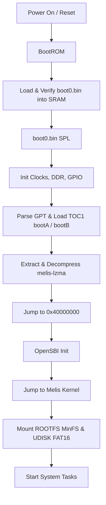

# Allwinner F133/D1s Melis Firmware Information

Some info collected during reverse engineering of the device firmware.
Description is based on the **HZ-B500-MB** device with 16MB SPI NOR flash, Melis RTOS and proprietary UI.

---

## 1. Boot Process Overview

Device boot sequence:



### Stage 1: BootROM (Hardcoded)
Primary hardware bootstrap.
Divided in 2 parts: FEL module (USB endpoint for low level operations) and Medium Boot module (loads BOOT0 from flash/SD card and runs it).
Executes from internal ROM (at address 0x0).

### Stage 2: Boot0 / SPL (Secondary Program Loader)
Responsible for DRAM and basic board initialization.
Reads the GPT partition table to locate the boot partition (`1_bootA` / `1_bootB`), which is packaged in the **TOC1** (`sunxi-package`) container format.
*   For unpacking:
    *   Parses the TOC1 package directory.
    *   Extracts the binary hardware configuration (`melis-config.bin` / `sys_config.bin`).
    *   Extracts and decompresses the main OS kernel (`melis-lzma.bin`) using LZMA into DRAM at `0x40000000`.
Jumps to `0x40000000` for execution.

### Stage 3: OpenSBI & Melis RTOS Kernel
Supervisor Environment Setup & Operating System execution.
*   **OpenSBI**:
    *   Linked at the start of the decompressed kernel image.
    *   Installs M-mode traps, emulation layers, and privilege switch handlers.
    *   Hands off execution to the Melis OS kernel in S-mode.
*   **Melis RTOS**:
    *   Initializes kernel services, drivers, and peripheral interfaces.
    *   Mounts the system partitions: **`2_ROOTFS`** (**MinFS**) and **`3_UDISK`** (**FAT16**).
    *   Spawns UI/system services.

---

## 2. Partition Layout

Based on the flash dump `dump_hz_b500_1_7.bin`:

| Image File | Offset | Size (Bytes) | Format | Description / Role |
| :--- | :--- | :--- | :--- | :--- |
| **`boot0.bin`** | `0x00000000` | `49,152` | eGON.BT0 | Primary bootloader (SPL) |
| **`gpt.bin`** | `0x0000c000` | Variable | GPT disk image | Preamble (`0_ppt.bin`) + partitions `1_bootA`, `2_ROOTFS`, `3_UDISK` |
| **`0_ppt.bin`** | Start of `gpt.bin` | `1,024` | GPT preamble | First two 512-byte LBAs: protective MBR (LBA 0) + primary GPT header beginning with `EFI PART` (LBA 1). Allwinner tooling label **PPT** (partition table); not userdata — leave unchanged when patching |
| **`1_bootA.bin`** | Inside GPT | Variable | TOC1 / sunxi-package | Boot package containing kernel payload & config |
| **`2_ROOTFS.bin`** | Inside GPT | `14,614,528` | MinFS | Allwinner proprietary RTOS filesystem (modules, apps, configurations) |
| **`3_UDISK.bin`** | Inside GPT | `917,504` | FAT16 | User disk partition containing resources and config scripts |

---

## 3. Extracted Sub-Components Detail

### `0_ppt.bin` (GPT Preamble)

Extracted from the first 1024 bytes of `gpt.bin` before numbered GPT partitions are read.

| Byte range | GPT role | Typical content |
| :--- | :--- | :--- |
| `0x000`–`0x1FF` | Protective MBR (LBA 0) | Often all zeros on SPI NOR Melis images |
| `0x200`–`0x3FF` | Primary GPT header (LBA 1) | Signature `EFI PART`, partition entry pointers, disk GUID |

*   **Not** a mountable firmware partition — unlike `1_bootA`, `2_ROOTFS`, or `3_UDISK`.
*   The `0_` prefix marks it as outside the GPT partition entry list (`1_` … `3_` come from partition names in the table).
*   **PPT** = legacy Allwinner name for the partition-table area (sunxi MBR era); on F133/D1s the layout is GPT, but the extractor keeps the old filename.
*   **Repacking:** `dump_tool pack` splices modified partition images into the original `gpt.bin` and preserves this header block automatically. You do not need to edit or restore `0_ppt.bin` for normal ROOTFS / UDISK / `sys_config.fex` workflows.

### `1_bootA.bin.out/` (TOC1 Container Output)
*   **`melis-config.bin`**: The binary-compiled `sys_config.bin` containing hardware configurations. Can be decompiled to human-readable FEX format.
*   **`melis-config.bin.out/sys_config.fex`**: The decompiled hardware layout (GPIO pins, interface modes, system parameters).
*   **`melis-lzma.bin`**: Raw compressed LZMA kernel package.
*   **`melis-lzma.decompressed`**: The decompressed kernel image. Begins with the OpenSBI wrapper (containing the `"opensbi"` metadata signature) linked directly to the Melis RTOS kernel.

### `2_ROOTFS.bin.out/` (MinFS Filesystem Output)
*   Holds the core components of the system.
*   Contains dynamic modules (`.mod` or `.drv`), GUI images, system config files, and core applications.
*   Extracted and repacked using the workspace `minfs` tool.

### `3_UDISK.bin.out/` (FAT16 Partition Output)
*   Used for user-space resource storage, configuration scripts, logs, or secondary assets.
*   Extracted and repacked using the workspace `udisk` tool.

---

## 4. Reversing, Patching, and Flashing

### Decompiling & Modifying Configs
1.  Extract the firmware using `dump_tool extract`.
2.  Open `sys_config.fex` inside `1_bootA.bin.out/`.
3.  Modify hardware parameters (e.g. enabling debugging consoles, swapping functional GPIO pins).
4.  `dump_tool pack` does **not** compile `sys_config.fex` back into `melis-config.bin` on its own — the `.fex` file is a human-readable reference copy only, and packing never silently rewrites your compiled config. To apply edits you made in `sys_config.fex`, recompile it explicitly: see [Extra: Manually Recompiling sys_config.fex](#extra-manually-recompiling-sys_configfex) below.

### Patching the OS Kernel & Modules
In theory patching the kernel should be possible, but since it's a big binary blob not very practical.
I think it might be easier to use the Melis kernel compiled from the source code since it's acting as HAL - main functions like AA and CarPlay are in UI/ROOTFS modules.
Ghidra could help analyzing the existing decompressed kernel.
D1s is based on T-Head Xuantie C906 core. There is some effort to support T-Head extensions in Ghidra: ([Issue #5778](https://github.com/NationalSecurityAgency/ghidra/pull/5778))

### Repacking the System Filesystem
1.  Modify contents within `2_ROOTFS.bin.out/` or `3_UDISK.bin.out/`.
2.  Use the repacking functionality:
    ```bash
    dump_tool pack <input_dir> <output_dump.bin>
    ```
    This automatically:
    *   Repacks the `2_ROOTFS.bin.out/` back into MinFS.
    *   Repacks the `3_UDISK.bin.out/` back into FAT16.
    *   Splices the repacked partition binaries back into the GPT image (`gpt.bin`) at their original offsets.
    *   Prepends `boot0.bin` to build the full flash image ready for writing.

---

## Extra: Manually Recompiling sys_config.fex

`dump_tool pack` never touches `melis-config.bin` on its own. Editing `sys_config.fex` and packing does nothing to that edit unless you recompile it back into binary first — that's a deliberate, separate step, not something packing does implicitly.

`melis-boot` includes a full port of Allwinner's `sys_config.fex` compiler (`melis-boot/src/fex_compiler.rs`) — it recompiles the *entire* file (integers, strings, GPIO pin specs, empty values), not just a hand-picked subset of keys, so any hardware parameter you change in `sys_config.fex` — UART settings, GPIO pin muxing, enabling a debug console, anything else the file describes — carries through. It's been validated to reproduce a real device's `melis-config.bin` byte-for-byte from its own decompiled `sys_config.fex`.

To use it:

1.  Extract the firmware: `dump_tool extract dump.bin out_dir`.
2.  Edit `out_dir/gpt.bin.out/1_bootA.bin.out/sys_config.fex` however you need.
3.  Build the compiler once:
    ```bash
    cargo build -p melis-boot --release --example compile_fex
    ```
4.  Recompile it (this **overwrites** `melis-config.bin` — keep a backup, there's no undo):
    ```bash
    ./target/release/examples/compile_fex \
      out_dir/gpt.bin.out/1_bootA.bin.out/sys_config.fex \
      out_dir/gpt.bin.out/1_bootA.bin.out/melis-config.bin
    ```
5.  Pack as normal: `dump_tool pack out_dir dump.repacked.bin`. It picks up the `melis-config.bin` you just recompiled; nothing else about pack (partition offsets/sizes, ROOTFS/UDISK repacking) is affected by this step.

---

## 4. Some device hacks

### Quick Start: Change Startup Logo

If you only want to change the boot-up logo **without modifying the firmware**:

1. Format an SD card as FAT32
2. Create a `Logo` directory on the card
3. Copy your JPEG image to `Logo/`
4. Insert the SD card into the device
5. Enter factory settings using code `112233`
6. Click "Internal card" text to switch to "External card"
7. Select your image to set it as the boot logo
8. Exit the menu — the image will be copied to UDISK as `stalogo.jpg`
9. Remove the SD card and reboot

### Factory Settings Passwords (HZ-B500-MB)

In the **Settings** menu, **Factory settings** entry asks for a 6-digit code. Each code opens a different hidden configuration screen.

**Source**: Passwords are defined in `2_ROOTFS.bin.out/apps/init.axf` (main shell / login UI). Password checks are hardcoded strings plus two values from `apps/Config.ini` (also on UDISK).

| Code | Menu (English) | Config / Notes |
|------|----------------|----------------|
| `112233` | Logo settings | `logoPassword` in `[CONFIG]` (default in firmware) → `SetupLogo.data` |
| `113266` | Factory settings | `factoryPaswword` in `[CONFIG]` (typo in stock INI) → `SetupFactory.data` |
| `112345` | Debug mode | Hardcoded → `SetupDebug.data` |
| `001106` | Factory settings (extended) | Hardcoded; menu id 25 (separate code path from `113266`) |
| `230762` | Interface selection | Hardcoded; UI style / layout picker (`uiType` / `uiID` area) |
| `123579` | Self-check | Hardcoded; minimal UI (can look "empty") |

Other digit strings exist in `init.axf` (WiFi defaults, version blobs, etc.) but are **not** wired into this login dispatcher.

---

## 5. Flash Dump: Creation and Recovery (HZ-B500-MB)

### Storage Media & Boot Priority

F133 supports multiple boot media: SPI NAND, SPI NOR, SD card, and eMMC.
HZ-B500-MB uses a 16MB **SPI NOR flash** for system boot.

The device supports firmware dump and recovery without opening the case using **FEL (Firmware Exchange Launch)** mode.

### FEL Mode Entry

F133 can enter FEL (a low-level bootloader mode) via USB if no valid boot media is found. The simplest approach for HZ-B500-MB is to use an SD card with a small boot image:

1.  Boot the device from the SD card → device enters FEL automatically
2.  Connect device to host via USB-A to USB-A cable
3.  Use `xfel_spi_nor` tool for read/write/erase operations

### Dump Flash via FEL

**Prerequisites:**
*   SD card (any size)
*   USB-A to USB-A cable
*   `sd_fel_switcher.bin` (included in toolkit)

**Steps:**

1. Write the FEL boot image to SD card:
```bash
sudo dd if=sd_fel_switcher/sd_fel_switcher.bin of=/dev/sdX bs=1024 seek=8 conv=notrunc
```
(Replace `sdX` with your card's device name — be careful!)

2. Insert SD card into device and connect USB cable to host

3. Device will boot and enter FEL automatically

4. Verify device detection:
```bash
lsusb | grep "Allwinner\|D1s"
```

5. Create a flash dump:
```bash
./xfel_spinor_dump.sh
```
This creates a `nor_dump_DATE.bin` file

### Recovery: Write Dump Back to Flash

To restore a previously dumped firmware:

```bash
./xfel_spinor_recovery.sh path/to/nor_dump.bin
```

> [!IMPORTANT]
> **Backup your original unmodified dump!** Using FEL and your original dump, you can unbrick the device if modifications go wrong. Keep a safe backup.

---

## 6. Device Debugging

### Serial Console (UART0 Debug)

The HZ-B500-MB has a test point labeled **"TX"** on the board. This is the SoC's **UART0 TX
output** — the pin is **PE2** (`UART0-TX`).

> [!IMPORTANT]
> **Pin assignment:**
> - **PE2** = `UART0-TX` (SoC transmit → your adapter RX) — this is the "TX" test point
> - **PE3** = `UART0-RX` (SoC receive → your adapter TX) — **no test point exposed**

**Setup:**
- Attach a **3.3V TTL** serial adapter (e.g. USB-to-UART)
- Connect adapter RX → board "TX" test point (PE2)
- Connect adapter TX → PE3 (requires soldering directly to the IC pin — see note below)
- Baud rate: **500,000** (500K) 8N1
- Provides: boot logs, kernel debug (`[DBG]`/`[ERR]` messages), FinSH shell (`msh />`)

**Note on RX (PE3)**: There is no "RX" test point. For bidirectional communication (to send
commands to the FinSH shell), you must solder directly to IC pin PE3 **and** enable UART0 RX
in `sys_config.fex` under `[uart_para]` + `[uart0]`.

### Serial Interfaces Table

| UART | Pins | FEX Config | Baud | Purpose |
|------|------|--------|------|---------|
| **UART0** (debug) | PE02 TX, PE03 RX | `[uart_para]` + `[uart0]` | **500000** 8N1 | FinSH shell (`msh />`), printk logs, debug messages (`[DBG]`/`[ERR]`) |
| **UART4** (MCU) | PE04 TX, PE05 RX | `[uart4]`, `Config.ini` → `mcuSerialName=/dev/uart4` | 115200 8N1 | Front-panel MCU communication — binary protocol (`02 80 …`), `CMcuCtrl` subsystem |
| **UART1** | PG12/PG13 | `[uart1]` in fex | — | **Unused** on this firmware; pins conflict with disabled `daudio1` I2S; wired to connector J6 |

### Apple CarPlay Authentication (MFi Coprocessor)

Wireless CarPlay support requires a physical **Apple MFi Authentication Coprocessor** (such as `CP2.0` or `CP3.0`). This coprocessor performs cryptographic handshakes for CarPlay sessions.

**Hardware Integration:**
*   **Component**: U31 label on HZ-B500-MB board
*   **Interface**: **TWI2** (I2C) bus
*   **Pins**: PE12 (SCL), PE13 (SDA)
*   **FEX Config**: Defined under `[twi2]` section in `sys_config.fex`

**Software Configuration:**
*   **Config file**: `Config.ini` (UDISK partition)
*   **Key**: `carplayI2cName=/dev/twi2` in the `[LINK]` section

**Discovery Notes:**
*   The exact I2C slave address of the MFi coprocessor can be sniffed from the TWI2 lines using a logic analyzer
*   See [PIN_MAPPING.md](PIN_MAPPING.md) for TWI2 device address table and additional sensor mappings

---

## 7. Melis `.data` UI format

This section is reverse-engineered from `init.axf` (with AI assistance). Offsets, types, and paint rules may be incomplete or wrong.

Car UI screens live in `2_ROOTFS` as `apps/Data/*.data` (UTF-16LE magic `DATA`, version `V1.0`). `desktop.mod` only installs `apps/init.axf`; `init.axf` is the compositor. `melis-data` parses the format; `data_renderer` is a quick viewer (1:1 blit, not a device compositor) and prints the widget tree.

This is **not** Melis 4.0 orange/`GUI_LyrWin`. Same desktop/display shell, different UI manager: widgets are deserialized from `.data` and 1:1-blitted.

### File layout

Little-endian. Typical canvas 1024×600.

| Offset | Size | Field |
| :--- | :--- | :--- |
| `0x00` | 8 | Magic, UTF-16LE `DATA` |
| `0x08` | 8 | Version, UTF-16LE `V1.0` |
| `0x10` | 4 | Header size (always `0x20`) |
| `0x14` | 4 | Declared main size |
| `0x18` | 8 | Reserved |
| `header_size` | 4 | Section size |
| +4 | 4 | Section metadata size (usually 20) |
| +8 | metadata | Screen + descriptor count (see below) |
| after metadata | 8×N | Descriptor table |
| after section | 4+8×M | Resource table: count, then `{file_offset, size}` |

Section metadata words (u32):

| Word | Meaning |
| :--- | :--- |
| 0, 1 | Unused / flags |
| 2, 3 | Screen width, height |
| 4 | Descriptor count |

Each descriptor is two u32s. Kind **5** is a UI widget tree; the other word is the file offset of that tree. Kind **6** appears in some files as a sibling record. The parser treats the word that is `5` or `6` as the kind and the other in-range offset as the payload.

### Widget block

```text
u32 total_size
u32 metadata_size
u8  metadata[metadata_size]   // parser cap: 0: 0x1c4, 1/2: 0x100, 3: 0x108, 4: 0xf8, 5: 0x1cc
… nested child slots (8 bytes: type, relative offset) …
… type-specific tail (type 4 image list) …
```

UTF-16LE name sits at the start of metadata (NUL-terminated). Rect is four u32s: type 0 at `+0x194`, all other types at `+0xcc` (`x, y, w, h`). Off-screen rects with `w,h > 0` (e.g. MainApp icons at x=1084) are kept; the runtime clips, it does not stretch them to the screen.

Nested children start at `block + 8 + metadata_size` (the *file* metadata size, not the parser cap). Each slot is `{type, offset}`.

| Type | Role | Idle bitmap | Nested |
| :--- | :--- | :--- | :--- |
| 0 | Text | — | — |
| 1 | Button | four indices at `+0xdc` (idle first) | optional type-4 image if `+0xfc`, type-0 caption if `+0xf4` |
| 2 | Slider | surface list at `+0xdc` (runtime lays out track/fill/thumb or stacks clock layers). `data_renderer` blits every listed surface 1:1 at the origin | optional caption if `+0xf8` |
| 3 | Grid / list | `+0xdc` columns, `+0xe0` rows, `+0xe4/+0xe8` cell size | up to 4 templates + caption if `+0x100` |
| 4 | Image | see below | optional type-0 if `+0xe0` |
| 5 | View (layer) | one index at `+0xdc` (`0xffffffff` = none) | `+0xec` child count |

Type 0 extras: UTF-16 text at `+0xcc..+0x194`, RGB at `+0x1a8`, align at `+0x1c0` bits 0..1 (0 left, 1 center, 2 right). Type 1/2 `string_id` at `+0xf0`.

**Type 4** does **not** store the resource index at `+0xdc` (`+0xdc` is an image *kind*). After metadata, skip 8 bytes if `+0xe0` or `+0xe4` is set, then `count` at `+0xe8` of `(kind, resource_index)` pairs. Idle blit uses the pair whose kind matches `+0xdc`; remaining pairs follow. Example: `CarComputer.data` car body `(0x63, 0)` 126×275, doors/trunk `(0x6f, 1..5)`.

Idle paint copies the **surface’s native `w×h`** at the widget origin (clip to dest). Do not scale the bitmap to the widget rect. Type-1 MainLink icons are 126×126 in a 126×160 hit box (caption in the leftover 34px). Type-5 `BtBook` panel is 531×432 in a 535×432 view — scaling the view desyncs baked chrome from child sprites.

### Resources / surfaces

Table follows the main section (tried at section end, then `main_size`, then `0x20 + main_size`). Count is u32, then `{file_offset, size}` × count. Each blob is `size + 0x18` bytes: a 0x18-byte header plus payload.

| Offset | Field |
| :--- | :--- |
| `+0x00` | Payload offset inside the blob (used if `≥ 0x18`; else payload starts at `0x18`) |
| `+0x04` | Width |
| `+0x08` | Height |
| `+0x0c` | Format |
| `+0x10` | Decode method |

| Format | Bytes/pixel | Layout |
| :--- | :--- | :--- |
| 1 | 4 | BGRA8888 |
| 2 | 2 | RGB565 LE, opaque |
| 3 | 3 | RGB565 LE + A5 in the third byte |

Row stride is `(width * bpp + 3) & ~3`. Decode method: `0` raw, `1` row RLE, `2` palette RLE, `3` zlib (flate). Fallback if the table is missing: scan for PNG/BMP signatures.

Format 3 blit: `a=0` skip (keep dest); `a=0x1f` copy (`pixel==0` becomes `0x0841`, the runtime’s near-black); else blend. `Power.data` is a full-screen format-2 fill of `0x0841` — a black power/ACC-off page, not a decode miss.

### Runtime composite

After a **content** page load, overlay widget arrays are spliced in (skipped when the file itself is an overlay):

| Layer | File | Notes |
| :--- | :--- | :--- |
| 0 | `WallPaper.data` | Empty shell: type-5, no surfaces. JPEGs `apps/WallPaper/{0..5}.jpg` are bound at runtime. |
| 3 | `SystemBar.data` | Two type-5 views: idle bar 1024×64, plus a 1024×600 pulldown. Idle chrome is the first view only. |
| 4 | `VolumeBar.data` | Event overlay |
| 5 | `TipBox.data` | Event overlay |

Page ids (home / back string ids `0x48` / `0x11` / `0x71` / `0x200` → **1**):

| Id | File |
| :--- | :--- |
| 1 / `0x65` | `Main.data` |
| 2 | `Main2.data` |
| 3 | `MainApp.data` |
| 4 | `MainSetup.data` (else `SetupMenu.data`) |
| 6 | `MainMedia.data` |
| 7 | `MainAux.data` |
| 8 | `MainLink.data` |
| 9 | `CarPlay.data` / `MainLinkCarPlay.data` |
| 10 | `AndroidAuto.data` / `MainLinkAuto.data` |
| `0xb` | `MirrorIphone.data` / `MainLinkMirrorIphone.data` |
| `0xd` | `MirrorAndroid.data` / `MainLinkMirrorAndroid.data` |
| `0xe` | `AndroidWireless.data` |
| `0xc9` | `MainAudioOutput.data` |

`CarComputer.data` is a separate content page (open by filename); it is not the default `0xc9` candidate.

Language tables: `apps/Language/*.txt`, header `//	原始	英文	…`, rows `{	key	en	zh	…}`. `data_renderer --lang en` picks the English column.
