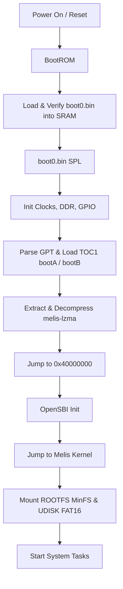

# Allwinner F133/D1s Melis Firmware Information

Notes collected while reverse-engineering this device's firmware.
Everything here is based on the **HZ-B500-MB** device: 16MB SPI NOR flash, Melis RTOS, proprietary UI.

---

## 1. Boot Process Overview



### Stage 1: BootROM (hardcoded)

The first thing that runs, straight out of internal ROM at address `0x0`. It has two halves: a FEL module (a USB endpoint for low-level recovery operations) and a "medium boot" module that loads `boot0` from whatever boot medium is present and jumps to it.

### Stage 2: boot0 / SPL (secondary program loader)

`boot0` brings up DRAM and does basic board init, then reads the GPT to find the boot partition (`1_bootA` or `1_bootB`), packaged as a **TOC1** container (Allwinner calls the container format `sunxi-package`). From there it:

*   Parses the TOC1 directory.
*   Extracts the binary hardware config (`melis-config.bin` / `sys_config.bin`).
*   Extracts and LZMA-decompresses the OS kernel (`melis-lzma.bin`) into DRAM at `0x40000000`.
*   Jumps there.

### Stage 3: OpenSBI & the Melis RTOS kernel

The decompressed kernel image starts with an OpenSBI wrapper (you can find the `"opensbi"` string in it), linked directly ahead of the Melis kernel. OpenSBI sets up M-mode traps and emulation, then hands off to Melis in S-mode, which initializes drivers, mounts **`2_ROOTFS`** (MinFS) and **`3_UDISK`** (FAT16), and starts the UI/system services.

---

## 2. Partition Layout

Layout as found on the `dump_hz_b500_1_7.bin` reference dump — **the exact offsets and sizes are device-specific**, not fixed constants; `dump_tool` reads them from each dump's own GPT rather than assuming this table.

| Image File | Offset | Size (Bytes) | Format | Description / Role |
| :--- | :--- | :--- | :--- | :--- |
| **`boot0.bin`** | `0x00000000` | `49,152` | eGON.BT0 | Primary bootloader (SPL) |
| **`gpt.bin`** | `0x0000c000` | Variable | GPT disk image | Preamble (`0_ppt.bin`) + partitions `1_bootA`, `2_ROOTFS`, `3_UDISK` |
| **`0_ppt.bin`** | Start of `gpt.bin` | `1,024` | GPT preamble | Protective MBR (LBA 0) + primary GPT header starting with `EFI PART` (LBA 1). Allwinner tooling calls this area **PPT** (partition table); it isn't user data — leave it untouched when patching |
| **`1_bootA.bin`** | Inside GPT | Variable | TOC1 / sunxi-package | Boot package: kernel payload + hardware config |
| **`2_ROOTFS.bin`** | Inside GPT | `14,614,528` | MinFS | Allwinner's proprietary RTOS filesystem — modules, apps, configs |
| **`3_UDISK.bin`** | Inside GPT | `917,504` | FAT16 | User-space storage: resources, config scripts |

---

## 3. Extracted Sub-Components Detail

### `0_ppt.bin` (GPT preamble)

The first 1024 bytes of `gpt.bin`, extracted before the numbered GPT partitions:

| Byte range | GPT role | Typical content |
| :--- | :--- | :--- |
| `0x000`–`0x1FF` | Protective MBR (LBA 0) | Often all zeros on SPI NOR Melis images |
| `0x200`–`0x3FF` | Primary GPT header (LBA 1) | Signature `EFI PART`, partition entry pointers, disk GUID |

A few things worth knowing about this block:

*   It's **not** a mountable firmware partition, unlike `1_bootA`, `2_ROOTFS`, or `3_UDISK` — it's metadata about where those partitions live, not one itself.
*   The `0_` prefix is there to mark it as outside the GPT's own partition entry list; `1_` through `3_` come straight from the partition names in that table.
*   "PPT" is a legacy Allwinner name from the sunxi-MBR era. F133/D1s actually use a real GPT, but the extractor keeps the old filename.
*   `dump_tool pack` splices repacked partitions back into the original `gpt.bin` and preserves this header block automatically — you never need to touch `0_ppt.bin` by hand for a normal ROOTFS/UDISK/`sys_config.fex` workflow.

### `1_bootA.bin.out/` (TOC1 container output)

*   **`melis-config.bin`** — the compiled binary hardware config (`sys_config.bin`). Decompiles to human-readable FEX.
*   **`melis-config.bin.out/sys_config.fex`** — the decompiled config: GPIO pins, interface modes, system parameters.
*   **`melis-lzma.bin`** — the raw, still-compressed kernel package.
*   **`melis-lzma.decompressed`** — the decompressed kernel image, starting with the OpenSBI wrapper described above.

### `2_ROOTFS.bin.out/` (MinFS filesystem output)

Holds the core of the system: dynamic modules (`.mod`/`.drv`), GUI images, config files, and the core applications. Extracted and repacked with the workspace `minfs` crate.

### `3_UDISK.bin.out/` (FAT16 partition output)

User-space storage — resources, config scripts, logs, secondary assets. Extracted and repacked with the workspace `udisk` crate.

---

## 4. Reversing, Patching, and Flashing

### Decompiling & modifying configs

1.  Extract the firmware with `dump_tool extract`.
2.  Open `sys_config.fex` inside `1_bootA.bin.out/`.
3.  Change whatever hardware parameter you need — enabling a debug console, swapping a GPIO's function, and so on.
4.  `dump_tool pack` does **not** compile `sys_config.fex` back into `melis-config.bin` on its own — the `.fex` file is a human-readable reference copy, and packing never silently rewrites your compiled config for you. Recompiling it is a separate, explicit step: see [Extra: Manually Recompiling sys_config.fex](#extra-manually-recompiling-sys_configfex).

### Patching the OS kernel & modules

In theory this should be possible, but the kernel is one big binary blob, so it's not very practical in practice. It's probably easier to work from the Melis kernel source instead — it acts as the HAL, while the interesting stuff (Android Auto, CarPlay) lives in the UI/ROOTFS modules. Ghidra can help with analyzing the decompressed kernel. D1s is built on the T-Head Xuantie C906 core; there's ongoing work to support T-Head extensions in Ghidra ([Issue #5778](https://github.com/NationalSecurityAgency/ghidra/pull/5778)).

### Repacking the system filesystem

1.  Modify contents inside `2_ROOTFS.bin.out/` or `3_UDISK.bin.out/`.
2.  Repack:
    ```bash
    dump_tool pack <input_dir> <output_dump.bin>
    ```
    This repacks `2_ROOTFS.bin.out/` back into MinFS, repacks `3_UDISK.bin.out/` back into FAT16, splices both back into the GPT image at their original offsets (read from the dump's own GPT), and prepends `boot0.bin` to produce a full, flashable image.

---

## Extra: Manually Recompiling sys_config.fex

`dump_tool pack` never touches `melis-config.bin` on its own. Editing `sys_config.fex` and packing does nothing with that edit unless you recompile it back into binary first — that's deliberately a separate step, not something packing does implicitly behind your back.

The release archives ship a `compile_fex` binary alongside `dump_tool` and `data_renderer` in `bin/`. It's a full Rust port of Allwinner's `sys_config.fex` compiler (source: `melis-boot/src/fex_compiler.rs`, built as `melis-boot/src/bin/compile_fex.rs`). It recompiles the *entire* file — integers, strings, GPIO pin specs, empty values — not just a hand-picked subset of keys, so any hardware parameter you change carries through: UART settings, GPIO muxing, debug consoles, anything else the file describes. It's been checked against a real device dump: recompiling that dump's own decompiled `sys_config.fex` reproduces its `melis-config.bin` byte-for-byte.

To use it:

1.  Extract the firmware: `dump_tool extract dump.bin out_dir`.
2.  Edit `out_dir/gpt.bin.out/1_bootA.bin.out/sys_config.fex` however you need.
3.  Recompile it (this **overwrites** `melis-config.bin` — keep a backup, there's no undo):
    ```bash
    ./bin/compile_fex \
      out_dir/gpt.bin.out/1_bootA.bin.out/sys_config.fex \
      out_dir/gpt.bin.out/1_bootA.bin.out/melis-config.bin
    ```
4.  Pack as normal: `dump_tool pack out_dir dump.repacked.bin`. It picks up the `melis-config.bin` you just recompiled; nothing else about pack (partition offsets/sizes, ROOTFS/UDISK repacking) is affected by this step.

---

## 4. Some device hacks

### Quick start: change the startup logo

If you only want to change the boot-up logo **without touching the firmware image at all**:

1.  Format an SD card as FAT32.
2.  Create a `Logo` directory on it.
3.  Copy your JPEG image into `Logo/`.
4.  Insert the SD card into the device.
5.  Enter factory settings with code `112233`.
6.  Tap "Internal card" to switch it to "External card".
7.  Select your image to set it as the boot logo.
8.  Exit the menu — the image gets copied onto UDISK as `stalogo.jpg`.
9.  Remove the SD card and reboot.

### Factory settings passwords (HZ-B500-MB)

The **Settings → Factory settings** entry asks for a 6-digit code. Each code opens a different hidden screen. These are defined in `2_ROOTFS.bin.out/apps/init.axf` (the main shell/login UI) — most are hardcoded strings, two come from `apps/Config.ini` on UDISK:

| Code | Menu (English) | Config / Notes |
|------|----------------|----------------|
| `112233` | Logo settings | `logoPassword` in `[CONFIG]` (default in firmware) → `SetupLogo.data` |
| `113266` | Factory settings | `factoryPaswword` in `[CONFIG]` (yes, that's a typo in the stock INI) → `SetupFactory.data` |
| `112345` | Debug mode | Hardcoded → `SetupDebug.data` |
| `001106` | Factory settings (extended) | Hardcoded; menu id 25, a separate code path from `113266` |
| `230762` | Interface selection | Hardcoded; UI style/layout picker (`uiType`/`uiID` area) |
| `123579` | Self-check | Hardcoded; minimal UI, can look empty |
| `000000` | Firmware update | Hardcoded → `SetupUpdate.data` (see below) |

There are other digit strings in `init.axf` (WiFi defaults, version blobs, etc.), but they aren't wired into this login dispatcher.

### SD / USB firmware update (`.img`)

**IMAGEWTY app image** (what `img_tool` produces):

```text
{drive}\Update\{appUpdateFile}
```

| Piece | Default (HZ-B500 `init.axf`) |
| :--- | :--- |
| Drive on insert | whatever Melis just mounted (`CarApp_DiskIn` — SD `type==0`, USB `type==1`) |
| Drive from settings | hardcoded `F:` |
| Filename | `LTTF133.img` (`[CONFIG] appUpdateFile` in UDISK `Config.ini`) |

Practical: FAT32 SD, **`Update\LTTF133.img`**. Insert the card (auto) or factory PIN **`000000`** / settings key that calls the same start function.

Sequence in `init.axf`: `file_exists` → install `d:\mod\update.mod` → ioctl **7** (`CarApi_CheckImage`) → UI `SetupUpdateApp` → thread → ioctl **2** with the full path → poll ioctl **4** until progress `100` → `esKSRV_Reset()`. Failed check → `SetupUpdateFail`.

**Same insert scan, other payloads** (not IMAGEWTY):

| Path | UI |
| :--- | :--- |
| `{drive}\Update\{mcuUpdateFile}` default `LTTMcu.bin` | `SetupUpdateMcu` |
| `{drive}\Update\BtHeadset.bin` | `SetupUpdateBtHeadset` |
| `{drive}\{mcu file}` at volume root | `SetupUpdate` |

Also looked at under `\Update\`: `Config.ini`, `stalogo.jpg`, a file named `E` (copied onto UDISK if present).

To flash a dump-derived image: `img_tool from-dump dump_out_dir` writes **`LTTF133.img`** by default — copy it to **`/Update/`** on the card.

`update.mod` erases SPI NOR with the raw item length and then the unused tail of the GPT partition. The spinor driver requires those lengths to be **4 KiB** aligned (`nor_erase: erase size 4k is not align to …`). Unaligned MinFS/TOC1 payloads make the last erase fail, the ROOTFS `add_sum` verify mismatches, and the burn retries forever while the UI timer keeps running. `img_tool pack` / `from-dump` pad bootA and ROOTFS items with `0xFF` to 4 KiB (and keep `V*.fex` in sync).

---

## 5. Flash Dump: Creation and Recovery (HZ-B500-MB)

### Storage media & boot priority

F133 supports several boot media: SPI NAND, SPI NOR, SD card, eMMC. HZ-B500-MB boots from a 16MB **SPI NOR** flash. You can dump and recover firmware without opening the case, using **FEL** (Firmware Exchange Launch) mode.

### Entering FEL mode

F133 drops into FEL — a low-level USB bootloader mode — if no valid boot media is found. The simplest way to trigger that on HZ-B500-MB is an SD card carrying a tiny boot image:

1.  Boot the device from that SD card → it enters FEL automatically.
2.  Connect it to your host over USB-A to USB-A.
3.  Use the `xfel_spi_nor` tool for read/write/erase.

### Dumping flash via FEL

**You'll need:** an SD card (any size), a USB-A to USB-A cable, and `sd_fel_switcher.bin` (included in this toolkit).

1.  Write the FEL boot image to the SD card:
    ```bash
    sudo dd if=sd_fel_switcher/sd_fel_switcher.bin of=/dev/sdX bs=1024 seek=8 conv=notrunc
    ```
    (Replace `sdX` with your card's actual device name — double-check this, it's destructive if wrong.)
2.  Insert the card into the device and connect USB to your host.
3.  The device boots and enters FEL automatically.
4.  Confirm it's detected:
    ```bash
    lsusb | grep "Allwinner\|D1s"
    ```
5.  Dump the flash:
    ```bash
    ./xfel_spinor_dump.sh
    ```
    This produces a `nor_dump_DATE.bin` file.

### Recovery: writing a dump back to flash

```bash
./xfel_spinor_recovery.sh path/to/nor_dump.bin
```

> [!IMPORTANT]
> **Keep your original, unmodified dump.** Together with FEL access, it's what lets you unbrick the device if a modification goes wrong. Back it up before you experiment.

---

## 6. Device Debugging

### Serial console (UART0 debug)

HZ-B500-MB has a test point labeled **"TX"** on the board — that's the SoC's UART0 **TX** output, pin **PE2**.

> [!IMPORTANT]
> **Pin assignment:**
> *   **PE2** = `UART0-TX` (SoC transmit → your adapter's RX) — this is the exposed "TX" test point.
> *   **PE3** = `UART0-RX` (SoC receive → your adapter's TX) — **no test point exposed for this one**.

**Setup:**
*   A 3.3V TTL USB-to-UART adapter.
*   Adapter RX → board "TX" test point (PE2).
*   Adapter TX → PE3 — this one requires soldering directly to the IC pin (no test point).
*   500,000 (500K) baud, 8N1.
*   Gives you: boot logs, kernel debug (`[DBG]`/`[ERR]` messages), and a FinSH shell (`msh />`).

Bidirectional communication (actually typing commands into FinSH, not just reading logs) needs that PE3 solder joint plus UART0 RX enabled in `sys_config.fex` under `[uart_para]` + `[uart0]`.

### Serial interfaces on this board

| UART | Pins | FEX config | Baud | Purpose |
|------|------|--------|------|---------|
| **UART0** (debug) | PE02 TX, PE03 RX | `[uart_para]` + `[uart0]` | 500000 8N1 | FinSH shell, `printk` logs, debug messages |
| **UART4** (MCU) | PE04 TX, PE05 RX | `[uart4]`, `Config.ini` → `mcuSerialName=/dev/uart4` | 115200 8N1 | Front-panel MCU link — binary protocol (`02 80 …`), `CMcuCtrl` subsystem |
| **UART1** | PG12/PG13 | `[uart1]` in fex | — | Unused on this firmware; pins conflict with disabled `daudio1` I2S; wired out to connector J6 |

### Apple CarPlay authentication (MFi coprocessor)

Wireless CarPlay needs a physical Apple **MFi Authentication Coprocessor** (e.g. `CP2.0`/`CP3.0`) to do the cryptographic handshake for each session.

**Hardware:** the `U31`-labeled component on HZ-B500-MB, on the **TWI2** (I2C) bus, pins PE12 (SCL) / PE13 (SDA) — defined under `[twi2]` in `sys_config.fex`.

**Software:** `Config.ini` on UDISK, key `carplayI2cName=/dev/twi2` in `[LINK]`.

The coprocessor's I2C slave address can be sniffed off the TWI2 lines with a logic analyzer. See [PIN_MAPPING.md](PIN_MAPPING.md) for the TWI2 device address table and other sensor mappings.

---

## 7. Melis `.data` UI Format

> Reverse-engineered from `init.axf`, with AI assistance. Offsets, types, and paint rules may be incomplete or wrong in places — treat this as a working model, not a spec.

Every screen in the car UI — the home screen, the setup menus, CarPlay, the system bar — is one file under `2_ROOTFS/apps/Data/*.data`. `desktop.mod` only ever installs one thing, `apps/init.axf`; `init.axf` *is* the compositor, and it's what reads these `.data` files and draws them. This repo's `melis-data` crate parses the format, and `data_renderer` is a small standalone viewer — it does a 1:1 blit of each widget's bitmap and dumps the widget tree as text, but it isn't a full reimplementation of the runtime compositor.

One thing worth flagging up front: this is **not** the "orange" `GUI_LyrWin` UI manager that ships in stock Melis 4.0. It's the same underlying desktop/display shell, but a different, custom UI manager layered on top — widgets are deserialized straight out of `.data` and blitted 1:1, rather than built from a `GUI_LyrWin` widget hierarchy.

The rest of this section walks through a `.data` file from the outside in: file header, then one "section" containing a widget tree, then the widget blocks themselves, then the image/text resources they reference, and finally how several `.data` files get composited together at runtime into what you actually see on screen.

### File header

20 bytes, little-endian, always at offset `0x00`:

| Offset | Size | Field |
| :--- | :--- | :--- |
| `0x00` | 8 | Magic — UTF-16LE `DATA` |
| `0x08` | 8 | Version — UTF-16LE `V1.0` |
| `0x10` | 4 | Header size (in every file seen so far, `0x20`) |
| `0x14` | 4 | Declared "main size" |
| `0x18` | 8 | Reserved |

The header's own declared size (`0x10`) tells you where the next part — the section — starts. In practice that's always `0x20`, i.e. right after this header.

### The section: one widget tree, described in two pieces

Right after the header comes exactly one "section." Despite the generic name, in every file we've looked at it holds exactly one thing: the root of that screen's widget tree. It's laid out as three parts back to back:

```text
u32 section_size          // total size of everything below, including this field
u32 metadata_size         // size of the metadata block that follows (usually 20 bytes)
u8  metadata[metadata_size]
{ u32 first; u32 second; } descriptor[N]   // N = descriptor count, taken from metadata
```

The `metadata` block is just a run of `u32` words. Two of those words are all that matters for parsing:

| Word index | Meaning |
| :--- | :--- |
| 0, 1 | Unused / flags |
| 2, 3 | Screen width, height |
| 4 | Descriptor count (`N` above) |

Screen size is normally 1024×600 — parsers fall back to that if it's missing.

Each **descriptor** is a pair of `u32`s, and which one is the "kind" isn't fixed to a position: the parser looks at both words and treats whichever one equals `5` or `6` as the kind, and the other one (as long as it's a valid in-range file offset) as the payload. In every file that matters, kind `5` is the one to follow: it's the file offset of the root widget block for that screen. Kind `6` shows up in some files as a sibling entry alongside it, but nothing currently reads it — it isn't a second widget tree.

So: to render a `.data` file, you read the header, jump to the section, read its metadata to get the screen size and descriptor count, and then follow every kind-`5` descriptor to a widget block. That's where the actual UI lives.

### Widget blocks: the UI tree itself

A widget block is a small self-describing header, some type-specific fixed-layout metadata, and then a list of child-widget references. Every block, regardless of type, starts the same way:

```text
u32 total_size       // size of this block, including nested children
u32 metadata_size    // size of the metadata that follows (as stored in the file)
u8  metadata[...]    // see below — actual length used is capped per type
```

That `metadata_size` field is what's stored in the file, but each widget **type** also has its own hardcoded upper bound, and the smaller of the two wins:

| Type | Cap |
| :--- | :--- |
| 0 (Text) | `0x1c4` |
| 1 (Button) | `0x100` |
| 2 (Slider) | `0x100` |
| 3 (Grid/list) | `0x108` |
| 4 (Image) | `0xf8` |
| 5 (View/layer) | `0x1cc` |

This cap exists so a corrupt or unexpectedly large `metadata_size` can't make the parser read past where a given type's known fields actually are — it's a safety clamp, not the "real" size of the metadata.

Two things sit at fixed offsets inside that metadata, for every type:

*   **Name** — a NUL-terminated UTF-16LE string right at the start (offset `0x00`). Not every widget has a human-readable name; when it doesn't, this is just left empty.
*   **Rect** — four `u32`s, `{x, y, width, height}`. For type 0 (Text) this lives at metadata offset `0x194`; for every other type, at `0xcc`.

One deliberate quirk to know about: widgets whose rect sits partly or fully off the visible canvas (e.g. the second and third page icons on the `MainApp` grid, which sit at `x=1084` and `x=1274` on a 1024-wide screen) are **kept**, not dropped or clipped down to the canvas. The real firmware clips them at paint time; it doesn't scale or reposition them, so `data_renderer` doesn't either — stretching them to fit would misplace and distort them.

After the metadata comes the **nested children list**, starting at `block_offset + 8 + metadata_size` — note that's the metadata size as *stored in the file*, not the (possibly smaller) capped size used above. Each child slot is 8 bytes: `{ u32 type; u32 offset; }`, where `offset` points at another widget block laid out exactly the same way. How many slots there are, and what type each one is allowed to be, depends on the parent's own type — described per type below.

#### Type 0 — Text

Plain text label, no children. Metadata carries the string itself (UTF-16LE, at `0xcc`–`0x194`), an RGB color as a packed `u32` at `0x1a8`, and a 2-bit horizontal alignment field at `0x1c0` (`0` = left, `1` = center, anything else = right).

#### Type 1 — Button

Metadata holds four resource indices at `0xdc` — the button's bitmaps for its idle/pressed/etc. states, idle first — and a `string_id` (a lookup key into the language table, see below) at `0xf0`. It can carry up to two children: an image (type 4) if the flag at `0xfc` is set, and a text caption (type 0) if the flag at `0xf4` is set — checked and consumed in that order.

#### Type 2 — Slider

Metadata holds a surface list at `0xdc` (same slot layout as Button's four indices, but terminated by `0xffffffff` rather than always being four long) and a `string_id` at `0xf0`. The runtime is expected to lay these surfaces out as track/fill/thumb — or, for a clock widget, stack them as separate layers — but `data_renderer` doesn't reproduce that layout logic; it just blits every listed surface 1:1 at the widget's origin. It can carry one optional caption child (type 0) if `0xf8` is set.

#### Type 3 — Grid / list

Metadata holds a 4-field grid description at `0xdc`: column count, row count, cell width, cell height (one `u32` each, in that order). It can carry up to four children unconditionally — the templates the grid instantiates per cell — plus one more optional caption (type 0) if `0x100` is set.

#### Type 4 — Image

This one's the most easily misread, because the obvious-looking field at `0xdc` is **not** a resource index — it's an image *kind* tag, used to pick which of several bitmap variants is the "idle" one. The actual bitmap list lives after the metadata:

1.  Start right after the metadata, at the normal nested-children offset.
2.  If the flag at `0xe0` is set, skip 8 bytes.
3.  If the flag at `0xe4` is set, skip another 8 bytes. (Both flags are checked independently, so you can skip 0, 8, or 16 bytes here depending on which are set — it isn't an either/or.)
4.  Read a `count` at `0xe8`.
5.  Read `count` pairs of `{ u32 kind; u32 resource_index; }`.

Whichever pair's `kind` matches the tag at `0xdc` is the idle bitmap; the rest are alternate variants (pressed states, animation frames, etc.). A concrete example from `CarComputer.data`: the car body widget has one pair, `(kind=0x63, index=0)`, a single 126×275 bitmap; the door/trunk widgets each have their own image block with pairs like `(kind=0x6f, index=1..5)`, one bitmap per door.

It can carry one optional child (type 0, a caption) if `0xe0` is set.

#### Type 5 — View (layer)

This is the container type — screens themselves are type-5 blocks, and so are reusable panels nested inside them. Metadata holds a single background-bitmap index at `0xdc` (`0xffffffff` means "no background bitmap"), and a child count at `0xec`. Unlike types 1–4, its children aren't restricted to one specific type each — the parser accepts any child type `0`–`4` in each of the `0xec` slots.

### Resources: images and text

Every non-text bitmap a widget references is an entry in a resource table that follows the section. Its exact position isn't fixed — the parser tries, in order, right after the section, at the header's declared `main_size`, and at `0x20 + main_size`, and uses whichever position parses as a plausible table. If none of them do, it falls back to scanning the whole file for PNG and BMP signatures instead.

Where it exists, the table is a `u32` count followed by that many `{ file_offset, size }` pairs. Each entry it points at is `size + 0x18` bytes: an 0x18-byte per-resource header, then the pixel data.

| Header offset | Field |
| :--- | :--- |
| `+0x00` | Payload offset *inside this blob* (used if it's `≥ 0x18`; otherwise the payload is assumed to start right at `0x18`) |
| `+0x04` | Width |
| `+0x08` | Height |
| `+0x0c` | Format |
| `+0x10` | Decode method |

**Pixel formats:**

| Format | Bytes/pixel | Layout |
| :--- | :--- | :--- |
| 1 | 4 | BGRA8888 |
| 2 | 2 | RGB565, little-endian, always opaque |
| 3 | 3 | RGB565 (2 bytes, little-endian) + a separate 1-byte, 5-bit alpha value |

Row stride is `(width * bytes_per_pixel + 3) & ~3` — rows are padded up to a 4-byte boundary, a standard bitmap convention.

**Decode methods:** `0` raw (no decoding needed), `1` row-based RLE, `2` palette-based RLE, `3` zlib/deflate. (Row and palette RLE aren't implemented as anything beyond "pass the payload through" in this codebase yet — treat them as raw if you hit one and the result looks wrong.)

Format 3 is the one with real per-pixel logic, since its "alpha" byte isn't a plain 0–255 value — it's five meaningful bits (`0`–`0x1f`), and the endpoints are special-cased rather than just meaning fully-transparent/fully-opaque:

*   `alpha == 0` → skip the pixel entirely, leaving whatever's already at that destination pixel.
*   `alpha == 0x1f` (max) **and** the RGB565 value is exactly `0` → treated as opaque and written as `0x0841` (a near-black, not literal RGB `0,0,0`) — a real color choice by the original renderer, not a decode failure.
*   Anything else → normal alpha blend, `alpha` scaled from its 5-bit range up to 8 bits.

One case this explains: `Power.data` decodes as a full-screen format-2 fill of `0x0841` — that's a genuine "power/ACC-off" black page, not evidence that the decoder got something wrong.

Regardless of format, a bitmap is always painted at its **own native width and height**, anchored at the widget's origin, clipped to the destination — never stretched or scaled to fill the widget's rect. Two examples that make this concrete: a MainLink button's rect is 126×160 (icon plus a 34px caption strip below it), but the icon bitmap inside it is only 126×126; and the `BtBook` panel view is 535×432, but its background bitmap is 531×432. Scaling either bitmap up to fill its widget's full rect would desync it from the other elements drawn on top of it.

### How screens combine at runtime

A single `.data` file is a "content page" — one full screen — or an "overlay," and the two get composited differently. After a content page loads, the runtime splices in a fixed stack of overlay files on top of it (this step is skipped when the file being loaded is itself one of the overlays, so overlays don't recursively overlay themselves):

| Layer | File | Notes |
| :--- | :--- | :--- |
| 0 | `WallPaper.data` | An empty type-5 shell with no surfaces of its own — the actual wallpaper JPEGs (`apps/WallPaper/{0..5}.jpg`) get bound onto it at runtime, they aren't embedded in the `.data` file. |
| 3 | `SystemBar.data` | Two type-5 views in one file: a 1024×64 idle bar, and a separate 1024×600 pulldown. Only the idle bar view is part of normal idle chrome; the pulldown is a distinct, larger view that the runtime shows on demand. |
| 4 | `VolumeBar.data` | Transient overlay, shown on volume change |
| 5 | `TipBox.data` | Transient overlay, shown for notifications/tips |

Which content page loads is driven by a numeric page id (the same ids used for "home"/"back" navigation — string ids `0x48`, `0x11`, `0x71`, and `0x200` all map back to page `1`):

| Id | File |
| :--- | :--- |
| 1 / `0x65` | `Main.data` |
| 2 | `Main2.data` |
| 3 | `MainApp.data` |
| 4 | `MainSetup.data` (falls back to `SetupMenu.data`) |
| 6 | `MainMedia.data` |
| 7 | `MainAux.data` |
| 8 | `MainLink.data` |
| 9 | `CarPlay.data` / `MainLinkCarPlay.data` |
| 10 | `AndroidAuto.data` / `MainLinkAuto.data` |
| `0xb` | `MirrorIphone.data` / `MainLinkMirrorIphone.data` |
| `0xd` | `MirrorAndroid.data` / `MainLinkMirrorAndroid.data` |
| `0xe` | `AndroidWireless.data` |
| `0xc9` | `MainAudioOutput.data` |

`CarComputer.data` is its own content page, opened directly by filename rather than through this id table — don't assume it's the default target for id `0xc9`.

### Text and the language tables

Widget text isn't always stored inline (type 0's own `text` field is one option, but buttons/sliders instead carry a numeric `string_id`). Those ids are resolved through `apps/Language/*.txt` — tab-separated tables where the header row starts with `//` followed by column names (`原始` for the original/key column, then one column per language, e.g. `英文` for English), and each data row is wrapped in `{ ... }`, e.g.:

```text
//	原始	英文	简体中文
{	开	ON	开	}
```

The key used to look up a string is the `原始` (original) column's value, not the numeric `string_id` directly — something upstream in the UI maps `string_id` values to these key strings. `data_renderer --lang en` picks the English column when rendering.
